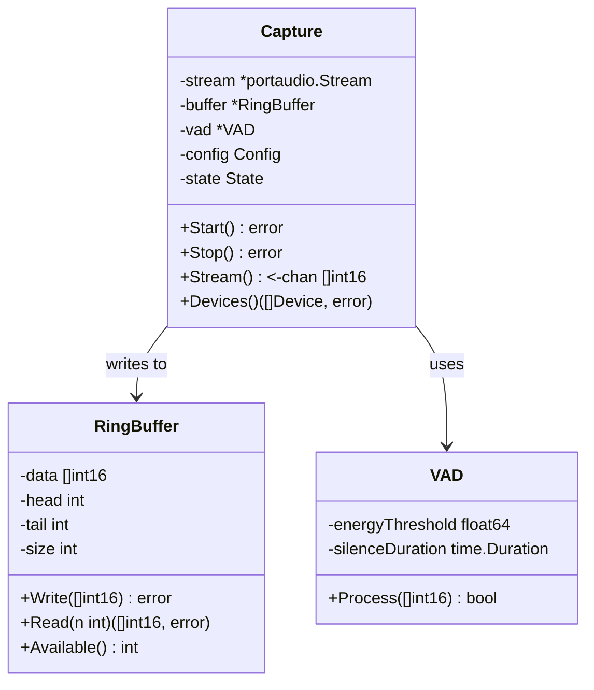

# Blueprint: Módulo de Captura de Áudio

## 1. Visão Geral

O módulo de áudio (`internal/audio`) é responsável por capturar o som do microfone em tempo real, processá-lo em chunks e disponibilizá-lo para o módulo de transcrição.

### Responsabilidades

- Inicializar e gerenciar a sessão com o driver de áudio (PortAudio)
- Capturar áudio em formato específico (WAV 16kHz, Mono, 16-bit)
- Gerenciar um buffer circular para evitar perda de dados
- Detectar atividade de voz (VAD) para segmentar fala
- Fornecer uma interface de streaming via Go Channels

## 2. Arquitetura



## 3. Interfaces Públicas

### Configuração

```go
type Config struct {
    SampleRate      int           // Padrão: 16000
    Channels        int           // Padrão: 1
    FrameSize       int           // Padrão: 1024 samples
    BufferDuration  time.Duration // Padrão: 5s
    DeviceID        int           // Padrão: -1 (Default)
}
```

### Interface Principal

```go
type AudioSource interface {
    Start() error
    Stop() error
    Stream() <-chan []int16
    Error() <-chan error
}
```

## 4. Fluxo de Dados

1. **PortAudio Callback**: O driver de áudio chama nossa função de callback a cada ~64ms (1024 samples @ 16kHz).
2. **VAD Check**: Verificamos se há voz no frame (opcional nesta etapa, pode ser feito pós-buffer).
3. **Ring Buffer**: Escrevemos os dados no buffer circular (thread-safe).
4. **Consumer Loop**: Uma goroutine lê do buffer e envia para o canal `Stream()`.
5. **Transcription**: O módulo de transcrição consome do canal.

## 5. Tratamento de Erros

- **Buffer Overflow**: Se o consumidor for lento, descartamos os dados mais antigos e logamos um aviso (drop strategy).
- **Device Lost**: Se o microfone for desconectado, tentamos reconectar ou emitimos erro fatal.
- **Latency Spikes**: Monitoramos o tempo de callback; se exceder o limite, alertamos.

## 6. Detalhes de Implementação

### Formato de Áudio

O Whisper exige estritamente:

- **Sample Rate**: 16000 Hz
- **Channels**: 1 (Mono)
- **Bit Depth**: 16-bit Integer (PCM)

### Voice Activity Detection (VAD)

Implementaremos um VAD baseado em energia inicialmente (simples e rápido):

1. Calcular RMS (Root Mean Square) do frame.
2. Se RMS > Threshold, marcar como fala.
3. Usar histerese para evitar "picotes" (manter ativo por X ms após silêncio).

### Ring Buffer

Usaremos um buffer fixo pré-alocado para evitar GC pressure.

- Tamanho sugerido: 5 segundos de áudio (16000 \* 5 = 80000 samples).
- Memória: ~160KB (desprezível).

## 7. Plano de Testes

1. **Unit Tests**:

   - `RingBuffer`: Testar leitura/escrita, overflow, wrap-around.
   - `VAD`: Testar detecção de silêncio e fala com ondas senoidais geradas.

2. **Integration Tests**:

   - `Capture`: Mockar PortAudio (se possível) ou usar loopback device.
   - Verificar se formato de saída bate com especificação.

3. **Benchmarks**:
   - Medir overhead do callback.
   - Medir latência total (Microfone -> Canal).
