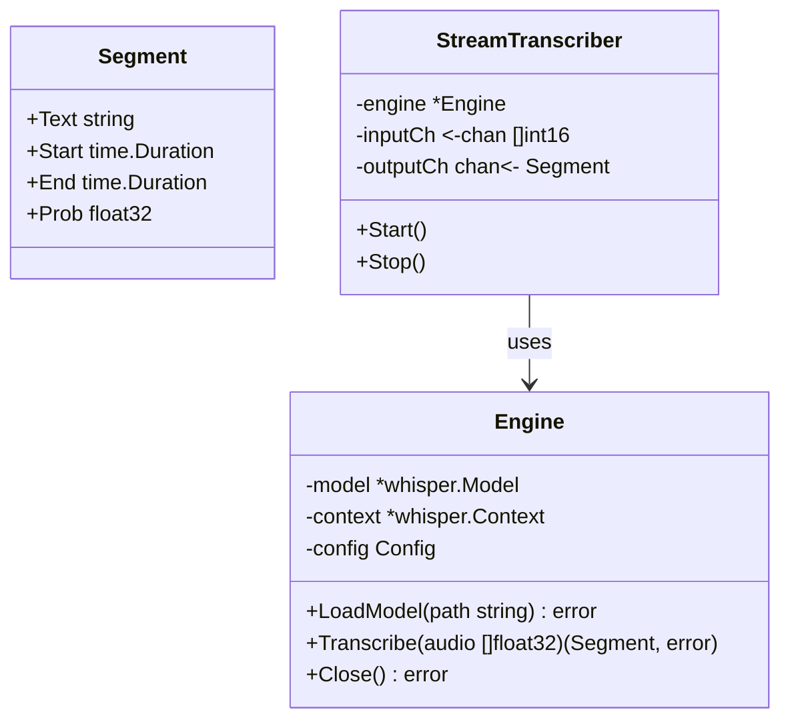

# Blueprint: Pipeline de Transcrição

## 1. Visão Geral

O módulo de transcrição (`internal/transcription`) recebe chunks de áudio PCM (do módulo de áudio) e os converte em texto usando o Whisper.cpp.

## 2. Arquitetura



## 3. Fluxo de Processamento

1. **Conversão de Formato**: O áudio chega como `[]int16` (PCM 16-bit). O Whisper espera `[]float32` normalizado entre -1.0 e 1.0.

   - Conversão: `float_sample = float32(int_sample) / 32768.0`

2. **Buffering de Contexto**: O Whisper funciona melhor com janelas de áudio de 30s, mas para ditado precisamos de respostas mais rápidas.

   - Estratégia: Processar chunks menores (ex: 3s a 5s) ou usar o modo "streaming" do whisper.cpp se disponível nos bindings.
   - Para V1: Acumular áudio até detectar silêncio (VAD) ou atingir tempo limite (ex: 5s), então enviar para transcrição.

3. **Inferência**:

   - Chamar `whisper_full` (função C do whisper.cpp).
   - Configurar idioma para "pt" (Português).
   - Habilitar `print_special = false`.

4. **Pós-processamento**:
   - Limpar espaços extras.
   - Filtrar alucinações comuns do Whisper (ex: repetição de "Legendas pela comunidade...").

## 4. Interfaces

```go
type Transcriber interface {
    // Transcribe converte um buffer de áudio em texto
    Transcribe(ctx context.Context, audio []float32) (string, error)
}

type ModelLoader interface {
    Load(path string) error
    Unload() error
}
```

## 5. Gerenciamento de Modelos

Os modelos ficam em `models/`. O sistema deve verificar a existência do modelo na inicialização e falhar graciosamente (ou pedir download) se não existir.

- Caminho padrão: `models/whisper-small.bin`
- Formato: GGML/GGUF (dependendo da versão do whisper.cpp)

## 6. Performance

- **Thread Count**: Configurar para usar número de núcleos físicos (não lógicos) para melhor performance.
- **Memória**: Monitorar uso. O modelo deve ser carregado apenas uma vez.

## 7. Tratamento de Erros

- Áudio muito curto (< 200ms): Ignorar.
- Falha na inferência: Retornar erro, não crashar.
- Modelo corrompido: Validar hash ao carregar.
