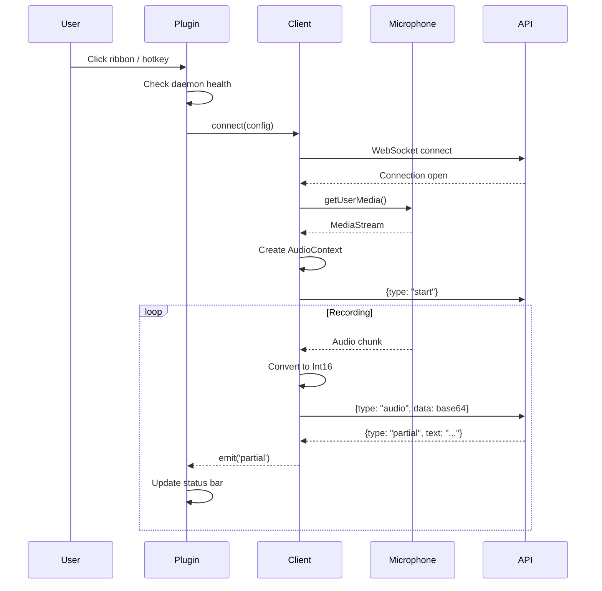
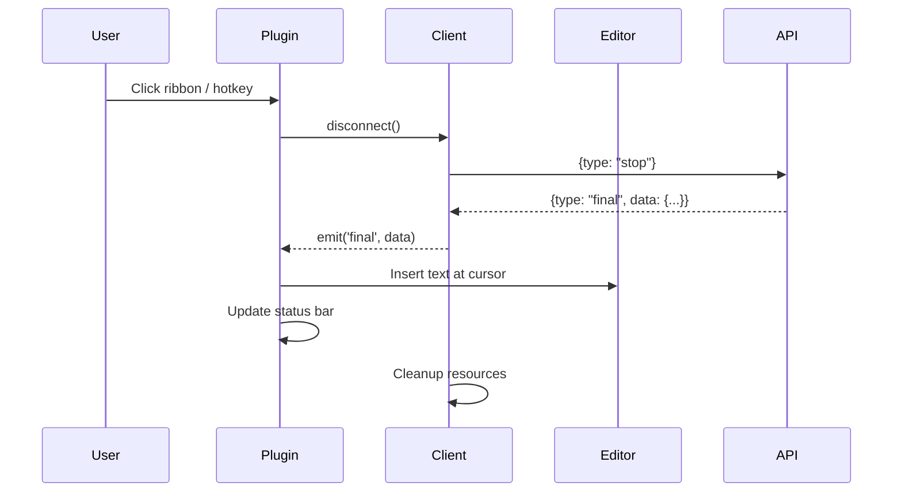

# Plugin Obsidian - Guia de Desenvolvimento

Este documento descreve a arquitetura e implementação do plugin Obsidian para dictate2me.

## Arquitetura

```
┌─────────────────────────────────────────────────┐
│              Obsidian Editor                     │
└────────────────┬────────────────────────────────┘
                 │
                 ↓
┌─────────────────────────────────────────────────┐
│          Dictate2Me Plugin                       │
│  ┌───────────────────────────────────────────┐  │
│  │  Main Plugin (main.ts)                    │  │
│  │  - Commands & UI                          │  │
│  │  - State Management                       │  │
│  │  - Event Handling                         │  │
│  └──────────┬────────────────────────────────┘  │
│             │                                     │
│  ┌──────────▼────────────┐  ┌────────────────┐  │
│  │  Client (client.ts)   │  │Settings        │  │
│  │  - WebSocket          │  │(settings.ts)   │  │
│  │  - Audio Capture      │  └────────────────┘  │
│  │  - Streaming          │                       │
│  └──────────┬────────────┘                       │
└─────────────┼──────────────────────────────────┘
              │ WebSocket
              ↓
┌─────────────────────────────────────────────────┐
│        dictate2me-daemon                         │
│        (API Server on localhost:8765)            │
└─────────────────────────────────────────────────┘
```

## Componentes

### 1. Main Plugin (`src/main.ts`)

Componente principal que implementa a interface `Plugin` do Obsidian.

**Responsabilidades:**

- Registrar comandos e hotkeys
- Gerenciar estado de gravação
- Coordenar UI (ribbon icon, status bar)
- Integrar com editor para inserção de texto

**Principais métodos:**

- `onload()`: Inicializa plugin
- `toggleDictation()`: Liga/desliga gravação
- `startDictation()`: Inicia captura e streaming
- `stopDictation()`: Para gravação
- `checkDaemonHealth()`: Verifica se daemon está rodando

### 2. WebSocket Client (`src/client.ts`)

Cliente que gerencia conexão com API e streaming de áudio.

**Responsabilidades:**

- Conectar ao WebSocket (`/api/v1/stream`)
- Capturar áudio do microfone
- Converter áudio para formato correto (16-bit PCM)
- Enviar chunks de áudio via WebSocket
- Receber e processar mensagens do servidor

**Event System:**

- `on('partial', handler)`: Resultados parciais
- `on('final', handler)`: Resultado final
- `on('error', handler)`: Erros

**Protocolo:**

```typescript
// Cliente → Servidor
{type: "start", data: {language: "pt", enableCorrection: true}}
{type: "audio", data: {data: "base64_audio"}}
{type: "stop"}

// Servidor → Cliente
{type: "partial", data: {text: "..."}}
{type: "final", data: {transcript: "...", corrected: "...", confidence: 0.95}}
{type: "error", data: {message: "..."}}
```

### 3. Settings (`src/settings.ts`)

Definição de configurações e defaults.

```typescript
interface Dictate2MeSettings {
  apiUrl: string; // URL da API
  apiToken: string; // Token de autenticação
  language: string; // Idioma (pt, en, es)
  enableCorrection: boolean; // Usar LLM para correção
  showPartialResults: boolean; // Mostrar resultados parciais
  showConfidence: boolean; // Mostrar score de confiança
  autoCheckDaemon: boolean; // Verificar daemon antes de gravar
}
```

### 4. Styles (`src/styles.css`)

Animações e estilos visuais.

**Features:**

- Animação de pulso vermelho durante gravação
- Estilos para status bar

## Fluxo de Execução

### Start Dictation



### Stop Dictation



## Audio Captura

### Pipeline de Áudio

```
Microphone
    ↓
MediaStream (getUserMedia)
    ↓
AudioContext (16kHz)
    ↓
ScriptProcessorNode (buffer 4096)
    ↓
Float32Array
    ↓
Convert to Int16Array (16-bit PCM)
    ↓
Convert to Base64
    ↓
Send via WebSocket
```

### Configuração de Áudio

```javascript
{
  audio: {
    channelCount: 1,        // Mono
    sampleRate: 16000,      // 16kHz (Vosk requirement)
    echoCancellation: true,  // Reduzir eco
    noiseSuppression: true,  // Reduzir ruído
    autoGainControl: true,   // Normalizar volume
  }
}
```

### Conversão de Formato

```typescript
// Float32 (-1.0 to 1.0) → Int16 (-32768 to 32767)
const int16Data = new Int16Array(audioData.length);
for (let i = 0; i < audioData.length; i++) {
  const sample = Math.max(-1, Math.min(1, audioData[i]));
  int16Data[i] =
    sample < 0
      ? sample * 0x8000 // -32768
      : sample * 0x7fff; // 32767
}
```

## UI Components

### Ribbon Icon

- **Localização**: Barra lateral esquerda
- **Estados**:
  - Normal: Ícone de microfone padrão
  - Recording: Pulsando em vermelho (CSS animation)
- **Ação**: Toggle recording on/off

### Status Bar

- **Localização**: Rodapé do Obsidian
- **Estados**:
  - `Ready`: Pronto para gravar
  - `🎤 Recording...`: Gravando
  - `💭 [text]`: Resultado parcial
  - `✓ Inserted (95%)`: Texto inserido com confiança
  - `Error`: Erro ocorreu

### Settings Tab

- **Localização**: Settings → Dictate2Me
- **Campos**:
  - API URL (text input)
  - API Token (text input)
  - Language (text input)
  - Enable Correction (toggle)
  - Show Partial Results (toggle)
  - Show Confidence (toggle)
  - Auto-check Daemon (toggle)
  - Test Connection (button)

## Build & Deploy

### Development

```bash
# Install dependencies
npm install

# Watch mode (auto-rebuild on changes)
npm run dev

# Manually copy to Obsidian vault for testing
cp main.js manifest.json styles.css ~/path/to/vault/.obsidian/plugins/dictate2me/
```

### Production Build

```bash
# Build for production
npm run build

# Creates:
# - main.js (bundled, minified)
# - manifest.json
# - styles.css
```

### Distribution

Para distribuir o plugin:

1. **Via GitHub Releases**:

   ```bash
   # Tag release
   git tag -a 0.1.0 -m "Release v0.1.0"
   git push origin 0.1.0

   # Attach files:
   # - main.js
   # - manifest.json
   # - styles.css
   ```

2. **Community Plugins** (futuro):
   - Submit PR to `obsidianmd/obsidian-releases`
   - Aguardar revisão e aprovação

## Testing

### Manual Testing

1. **Build plugin**:

   ```bash
   npm run build
   ```

2. **Copy to vault**:

   ```bash
   cp main.js manifest.json styles.css \
      ~/Documents/ObsidianVault/.obsidian/plugins/dictate2me/
   ```

3. **Reload Obsidian**:

   - Cmd/Ctrl + R ou reabrir Obsidian

4. **Enable plugin**:

   - Settings → Community Plugins → Enable "Dictate2Me"

5. **Configure**:

   - Settings → Dictate2Me
   - Add token from `~/.dictate2me/api-token`

6. **Test**:
   - Click ribbon icon ou Cmd/Ctrl+Shift+D
   - Speak into microphone
   - Click again to stop
   - Verify text inserted

### Automated Testing

```bash
# Unit tests (futuro)
npm test

# E2E tests (futuro)
npm run test:e2e
```

## Troubleshooting

### Plugin não carrega

- Verificar console do Obsidian (View → Toggle Developer Tools)
- Verificar se `main.js` foi copiado corretamente
- Verificar se `manifest.json` está válido

### "Cannot find module"

- Rodar `npm install`
- Rodar `npm run build` novamente

### WebSocket não conecta

- Verificar se daemon está rodando: `curl http://localhost:8765/api/v1/health`
- Verificar configuração de URL nas settings
- Verificar token

### Microfone não funciona

- Verificar permissões do sistema
- Verificar console para erros de `getUserMedia`
- Testar em navegador: `navigator.mediaDevices.getUserMedia({audio: true})`

## Performance

### Otimizações

- **Audio buffering**: Buffer de 4096 samples (~256ms a 16kHz)
- **Base64 encoding**: Batch encoding para reduzir overhead
- **Event throttling**: Debounce de eventos parciais
- **Cleanup**: Liberar recursos AudioContext ao parar

### Memória

- **MediaStream**: ~1MB
- **AudioContext**: ~2MB
- **WebSocket**: ~100KB
- **Total**: ~3-5MB durante gravação

## Segurança

- ✅ **Localhost only**: API aceita apenas conexões locais
- ✅ **Token auth**: Todas as requisições autenticadas
- ✅ **HTTPS**: Não necessário (localhost)
- ✅ **Permissions**: Plugin solicita permissão de microfone
- ✅ **No telemetry**: Zero coleta de dados

## Future Improvements

### V2.0

- [ ] Suporte a múltiplos idiomas via UI
- [ ] Histórico de transcrições
- [ ] Atalhos customizáveis
- [ ] Temas de cores
- [ ] Export de settings

### V2.1

- [ ] VAD (Voice Activity Detection) no client
- [ ] Compressão de áudio antes de enviar
- [ ] Cache de resultados
- [ ] Offline mode com fallback

### V3.0

- [ ] Integração com Templates
- [ ] Comandos via voz ("new note", "bold", etc.)
- [ ] Multi-cursor support
- [ ] Real-time collaboration

## Resources

- [Obsidian Plugin API](https://github.com/obsidianmd/obsidian-api)
- [Obsidian Sample Plugin](https://github.com/obsidianmd/obsidian-sample-plugin)
- [WebSocket API](https://developer.mozilla.org/en-US/docs/Web/API/WebSocket)
- [Web Audio API](https://developer.mozilla.org/en-US/docs/Web/API/Web_Audio_API)

---

**Last Updated:** 2025-12-02
