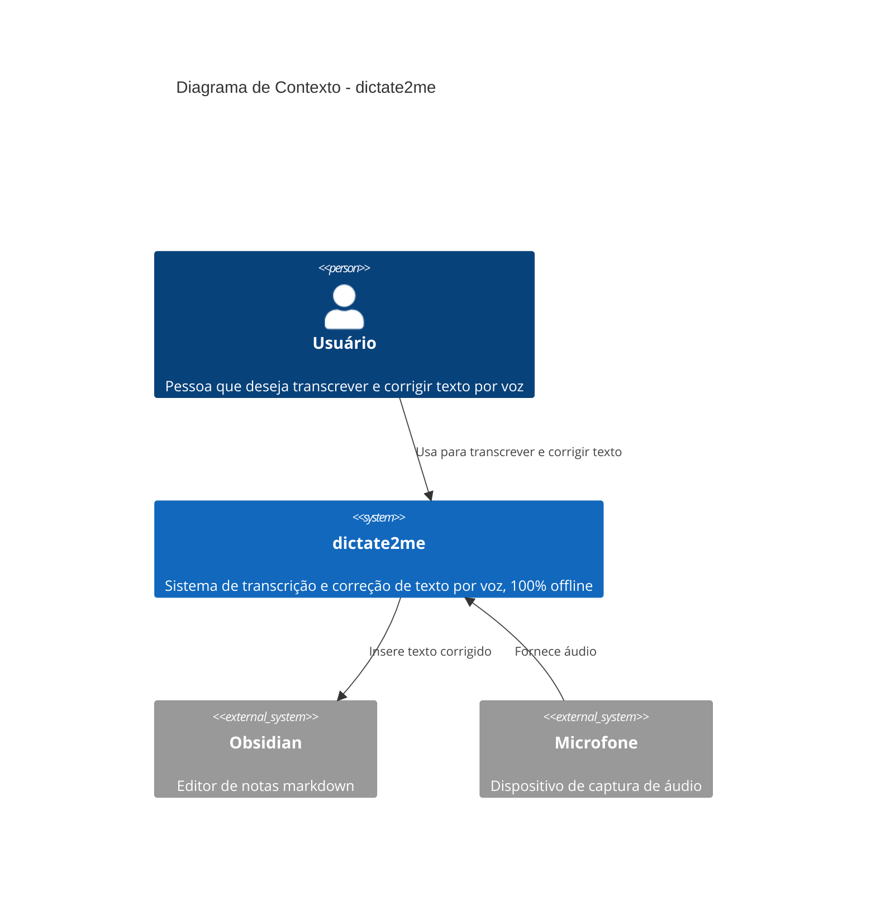
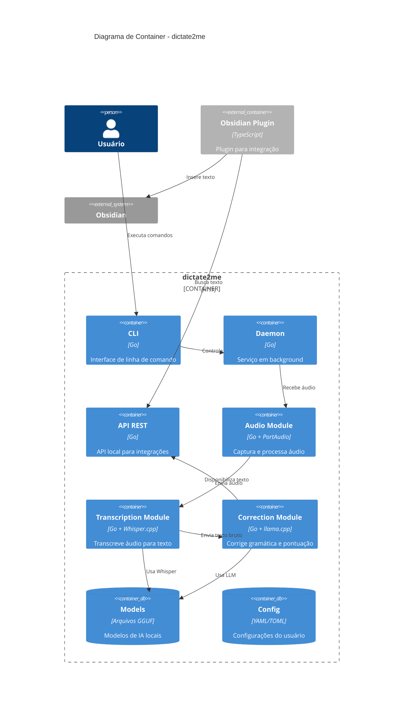
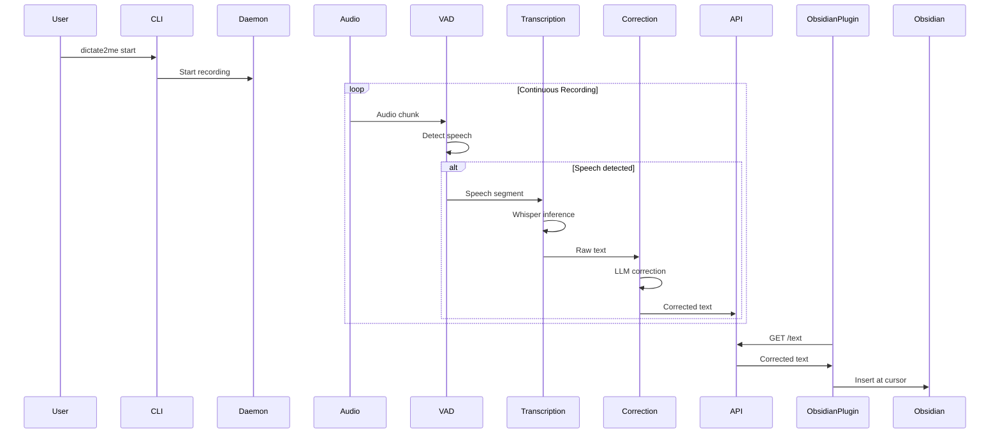

# dictate2me - Prompt Completo para Google AI Studio / Gemini

## 🎯 CONTEXTO DO PROJETO

Você é um arquiteto de software sênior especializado em sistemas de baixo nível, processamento de linguagem natural e aplicações desktop cross-platform. Você irá me auxiliar no desenvolvimento completo de um aplicativo open-source chamado **dictate2me**.

---

## 📋 VISÃO DO PRODUTO

**dictate2me** é um aplicativo open-source de captura de voz e correção textual que:

1. **Captura áudio** do microfone do usuário em tempo real
2. **Transcreve para texto** usando modelo de IA local (100% offline)
3. **Corrige automaticamente** gramática, sintaxe e pontuação usando LLM local
4. **Insere o texto corrigido** diretamente em editores de texto (inicialmente Obsidian)

### Público-Alvo

- Escritores e criadores de conteúdo
- Profissionais que precisam documentar rapidamente
- Pessoas com dificuldades motoras que preferem ditado
- Desenvolvedores que querem documentar código por voz

---

## 🔒 REQUISITOS TÉCNICOS OBRIGATÓRIOS

### R1 - Processamento 100% Local (Offline-First)

- Transcrição de voz DEVE funcionar sem internet
- LLM de correção DEVE rodar localmente
- NENHUM dado do usuário pode sair do dispositivo
- Modelos de IA baixados uma vez e cacheados localmente

### R2 - Eficiência de Recursos (Prioridade Máxima)

- Consumo máximo de RAM: 4GB em operação plena
- Consumo de CPU em idle: < 5% de um núcleo
- Consumo de CPU em transcrição: máximo 100% de um núcleo
- Binário final: < 50MB (excluindo modelos de IA)
- Tempo de inicialização: < 3 segundos

### R3 - Arquitetura Cross-Platform

- **Plataforma inicial**: macOS Tahoe (macOS 26)
- **Futuras plataformas**: Windows 11, Linux (Ubuntu 24.04+, Fedora 40+)
- Abstrações para syscalls específicas de cada OS
- Build system unificado com suporte a cross-compilation

### R4 - Qualidade de Código (Não Negociável)

- **Cobertura de testes**: 100% (unit, integration, e2e)
- **Linting**: golangci-lint com configuração strict
- **Formatação**: gofmt + goimports
- **Documentação**: GoDoc para TODAS as funções públicas
- **Commits**: Conventional Commits (feat, fix, docs, etc.)
- **CI/CD**: GitHub Actions com checks obrigatórios

### R5 - Documentação Abrangente

- Código 100% comentado seguindo padrões GoDoc
- Documentos complementares para cada módulo
- ADRs (Architecture Decision Records) para toda decisão significativa
- Diagramas C4 para arquitetura
- Exemplos de uso para cada funcionalidade

---

## 🛠️ STACK TECNOLÓGICA DEFINIDA

```yaml
core:
  language: Go 1.23+
  build_system: Mage (alternativa Go-native ao Make)
  package_manager: Go Modules

audio:
  capture: PortAudio (via go-portaudio)
  format: WAV 16kHz mono 16-bit
  vad: WebRTC VAD ou Silero VAD (via ONNX)

transcription:
  engine: whisper.cpp (via CGO bindings)
  model_default: whisper-small (otimizado para português)
  model_quality: whisper-medium (opcional, maior precisão)
  quantization: Q5_K_M ou Q4_K_M

correction:
  engine: llama.cpp (via go-llama.cpp ou ollama)
  model_primary: Phi-3-mini-4k-instruct (Q4_K_M)
  model_alternative: Gemma-2B-it (Q4_K_M)
  context_window: 4096 tokens
  prompt_template: especializado em correção PT-BR

integration:
  obsidian_plugin: TypeScript/JavaScript
  protocol: HTTP REST API local (localhost:PORT)
  fallback: Unix Domain Socket (macOS/Linux)

gui_future:
  framework: Wails v2 (Go backend + WebView frontend)
  frontend: Svelte 5 ou Vue 3
  styling: Tailwind CSS

testing:
  unit: testing + testify/assert
  mocks: mockery ou gomock
  integration: testcontainers-go
  e2e: playwright (para GUI futura)
  coverage: go tool cover (threshold: 100%)
  benchmarks: testing.B para hot paths

observability:
  logging: slog (stdlib Go 1.21+)
  metrics: prometheus/client_golang (opcional)
  tracing: OpenTelemetry (futuro)
```

---

## 📁 ESTRUTURA DO PROJETO

```
dictate2me/
│
├── .github/                          # Configurações GitHub
│   ├── ISSUE_TEMPLATE/
│   │   ├── bug_report.md
│   │   ├── feature_request.md
│   │   └── config.yml
│   ├── PULL_REQUEST_TEMPLATE.md
│   ├── FUNDING.yml
│   ├── dependabot.yml
│   ├── CODEOWNERS
│   └── workflows/
│       ├── ci.yaml                   # Build, test, lint
│       ├── release.yaml              # Releases automatizados
│       └── security.yaml             # Scans de segurança
│
├── cmd/                              # Entrypoints da aplicação
│   ├── dictate2me/                  # CLI principal
│   │   └── main.go
│   └── dictate2me-daemon/           # Daemon de background
│       └── main.go
│
├── internal/                         # Código privado (não exportável)
│   ├── audio/                        # Módulo de captura de áudio
│   │   ├── capture.go
│   │   ├── capture_test.go
│   │   ├── buffer.go
│   │   ├── buffer_test.go
│   │   ├── vad.go                    # Voice Activity Detection
│   │   ├── vad_test.go
│   │   └── doc.go                    # Documentação do pacote
│   │
│   ├── transcription/                # Módulo de transcrição
│   │   ├── whisper.go
│   │   ├── whisper_test.go
│   │   ├── models.go
│   │   ├── models_test.go
│   │   └── doc.go
│   │
│   ├── correction/                   # Módulo de correção LLM
│   │   ├── llm.go
│   │   ├── llm_test.go
│   │   ├── prompts.go
│   │   ├── prompts_test.go
│   │   ├── cache.go
│   │   ├── cache_test.go
│   │   └── doc.go
│   │
│   ├── integration/                  # Integrações externas
│   │   ├── obsidian/
│   │   │   ├── client.go
│   │   │   ├── client_test.go
│   │   │   └── doc.go
│   │   └── editor.go                 # Interface abstrata para editores
│   │
│   ├── api/                          # API REST local
│   │   ├── server.go
│   │   ├── server_test.go
│   │   ├── handlers.go
│   │   ├── handlers_test.go
│   │   ├── middleware.go
│   │   └── doc.go
│   │
│   ├── config/                       # Configuração da aplicação
│   │   ├── config.go
│   │   ├── config_test.go
│   │   ├── validation.go
│   │   └── doc.go
│   │
│   └── platform/                     # Abstrações específicas de OS
│       ├── platform.go               # Interface comum
│       ├── audio_darwin.go           # macOS
│       ├── audio_linux.go            # Linux
│       ├── audio_windows.go          # Windows
│       └── doc.go
│
├── pkg/                              # Código público reutilizável
│   └── textutils/
│       ├── normalize.go
│       ├── normalize_test.go
│       └── doc.go
│
├── plugins/                          # Plugins para editores
│   └── obsidian-dictate2me/
│       ├── src/
│       │   ├── main.ts
│       │   ├── settings.ts
│       │   └── api.ts
│       ├── manifest.json
│       ├── package.json
│       ├── tsconfig.json
│       ├── esbuild.config.mjs
│       └── README.md
│
├── models/                           # Diretório para modelos de IA
│   ├── .gitkeep
│   └── README.md                     # Instruções de download
│
├── docs/                             # Documentação completa
│   ├── ARCHITECTURE.md               # Visão arquitetural (C4)
│   ├── DESIGN.md                     # Decisões de design
│   ├── API.md                        # Documentação da API REST
│   ├── DEVELOPMENT.md                # Guia para desenvolvedores
│   ├── TROUBLESHOOTING.md            # Resolução de problemas
│   │
│   ├── adr/                          # Architecture Decision Records
│   │   ├── README.md
│   │   ├── template.md
│   │   ├── 0001-linguagem-go.md
│   │   ├── 0002-whisper-cpp-transcricao.md
│   │   ├── 0003-llm-local-correcao.md
│   │   ├── 0004-arquitetura-plugins.md
│   │   └── 0005-api-rest-local.md
│   │
│   ├── blueprints/                   # Blueprints de módulos
│   │   ├── audio-capture.md
│   │   ├── transcription-pipeline.md
│   │   ├── correction-engine.md
│   │   └── obsidian-integration.md
│   │
│   ├── diagrams/                     # Diagramas (Mermaid/PlantUML)
│   │   ├── c4-context.md
│   │   ├── c4-container.md
│   │   ├── c4-component.md
│   │   ├── sequence-transcription.md
│   │   └── data-flow.md
│   │
│   └── api/
│       └── openapi.yaml              # Especificação OpenAPI 3.0
│
├── scripts/                          # Scripts utilitários
│   ├── download-models.sh            # Download de modelos de IA
│   ├── setup-dev.sh                  # Setup ambiente de desenvolvimento
│   ├── generate-mocks.sh             # Geração de mocks
│   └── check-coverage.sh             # Verificação de cobertura
│
├── configs/                          # Arquivos de configuração exemplo
│   ├── dictate2me.example.yaml
│   └── dictate2me.example.toml
│
├── testdata/                         # Dados para testes
│   ├── audio/
│   │   ├── sample-pt-br.wav
│   │   └── sample-silence.wav
│   └── text/
│       ├── input-errors.txt
│       └── expected-corrected.txt
│
│
│ # ══════════════════════════════════════════════════════════════
│ # DOCUMENTOS ESSENCIAIS DO PROJETO OPEN-SOURCE
│ # ══════════════════════════════════════════════════════════════
│
├── README.md                         # Documento principal
├── LICENSE                           # Licença (MIT ou Apache 2.0)
├── CONTRIBUTING.md                   # Guia de contribuição
├── CODE_OF_CONDUCT.md                # Código de conduta
├── SECURITY.md                       # Política de segurança
├── CHANGELOG.md                      # Histórico de mudanças
├── GOVERNANCE.md                     # Modelo de governança
├── MAINTAINERS.md                    # Lista de mantenedores
├── SUPPORT.md                        # Como obter suporte
│
│
│ # ══════════════════════════════════════════════════════════════
│ # ARQUIVOS DE CONFIGURAÇÃO
│ # ══════════════════════════════════════════════════════════════
│
├── go.mod                            # Go modules
├── go.sum                            # Checksums de dependências
├── magefile.go                       # Build tasks (Mage)
├── Makefile                          # Fallback para quem não tem Mage
├── .golangci.yaml                    # Configuração do linter
├── .editorconfig                     # Configuração de editor
├── .gitignore                        # Arquivos ignorados pelo Git
├── .gitattributes                    # Atributos do Git
└── .pre-commit-config.yaml           # Hooks de pré-commit
```

---

## 📄 DOCUMENTOS ESSENCIAIS DO PROJETO

Abaixo estão os templates e conteúdos que DEVEM ser criados no início do projeto:

---

### 1. README.md

````markdown
<div align="center">
  
  
  # dictate2me
  
  **Transcrição de voz e correção textual 100% offline**
  
  [](https://go.dev/)
  [](LICENSE)
  [](https://github.com/seu-usuario/dictate2me/actions)
  [](https://codecov.io/gh/seu-usuario/dictate2me)
  [](https://securityscorecards.dev/viewer/?uri=github.com/seu-usuario/dictate2me)
  
  [Instalação](#instalação) •
  [Uso Rápido](#uso-rápido) •
  [Documentação](#documentação) •
  [Contribuindo](#contribuindo)
</div>

---

## ✨ Funcionalidades

- 🎤 **Captura de Áudio** - Gravação em tempo real do microfone
- 📝 **Transcrição Offline** - Powered by Whisper, sem enviar dados para nuvem
- ✏️ **Correção Inteligente** - LLM local para gramática, sintaxe e pontuação
- 🔌 **Integração com Obsidian** - Plugin nativo para inserção direta
- 🖥️ **Cross-Platform** - macOS, Windows e Linux (em breve)
- 🔒 **Privacidade Total** - Seus dados nunca saem do seu computador

## 🚀 Instalação

### Pré-requisitos

- macOS 14+ (Sonoma) ou macOS 15 (Tahoe)
- 8GB RAM mínimo (16GB recomendado)
- 5GB de espaço em disco (para modelos de IA)

### Via Homebrew (Recomendado)

```bash
brew tap seu-usuario/dictate2me
brew install dictate2me
```
````

### Download Direto

Baixe o binário mais recente em [Releases](https://github.com/seu-usuario/dictate2me/releases).

### Compilar do Código-Fonte

```bash
git clone https://github.com/seu-usuario/dictate2me.git
cd dictate2me
./scripts/setup-dev.sh
mage build
```

## 📖 Uso Rápido

### 1. Baixar Modelos de IA

```bash
dictate2me models download
```

### 2. Iniciar Gravação

```bash
dictate2me start
```

### 3. Transcrever Arquivo

```bash
dictate2me transcribe audio.wav --output texto.txt
```

## 📚 Documentação

| Documento                               | Descrição                  |
| --------------------------------------- | -------------------------- |
| [ARCHITECTURE.md](docs/ARCHITECTURE.md) | Visão geral da arquitetura |
| [API.md](docs/API.md)                   | Documentação da API REST   |
| [DEVELOPMENT.md](docs/DEVELOPMENT.md)   | Guia para desenvolvedores  |
| [ADRs](docs/adr/)                       | Decisões arquiteturais     |

## 🤝 Contribuindo

Contribuições são bem-vindas! Por favor, leia nosso [Guia de Contribuição](CONTRIBUTING.md) antes de submeter PRs.

1. Fork o repositório
2. Crie sua branch (`git checkout -b feature/AmazingFeature`)
3. Commit suas mudanças (`git commit -m 'feat: add amazing feature'`)
4. Push para a branch (`git push origin feature/AmazingFeature`)
5. Abra um Pull Request

## 📄 Licença

Este projeto está licenciado sob a Licença MIT - veja o arquivo [LICENSE](LICENSE) para detalhes.

## 🙏 Agradecimentos

- [Whisper.cpp](https://github.com/ggerganov/whisper.cpp) - Motor de transcrição
- [llama.cpp](https://github.com/ggerganov/llama.cpp) - Inferência de LLM
- [Obsidian](https://obsidian.md/) - Editor de notas

```

---

### 2. LICENSE (MIT)

```

MIT License

Copyright (c) 2025 dictate2me Contributors

Permission is hereby granted, free of charge, to any person obtaining a copy
of this software and associated documentation files (the "Software"), to deal
in the Software without restriction, including without limitation the rights
to use, copy, modify, merge, publish, distribute, sublicense, and/or sell
copies of the Software, and to permit persons to whom the Software is
furnished to do so, subject to the following conditions:

The above copyright notice and this permission notice shall be included in all
copies or substantial portions of the Software.

THE SOFTWARE IS PROVIDED "AS IS", WITHOUT WARRANTY OF ANY KIND, EXPRESS OR
IMPLIED, INCLUDING BUT NOT LIMITED TO THE WARRANTIES OF MERCHANTABILITY,
FITNESS FOR A PARTICULAR PURPOSE AND NONINFRINGEMENT. IN NO EVENT SHALL THE
AUTHORS OR COPYRIGHT HOLDERS BE LIABLE FOR ANY CLAIM, DAMAGES OR OTHER
LIABILITY, WHETHER IN AN ACTION OF CONTRACT, TORT OR OTHERWISE, ARISING FROM,
OUT OF OR IN CONNECTION WITH THE SOFTWARE OR THE USE OR OTHER DEALINGS IN THE
SOFTWARE.

````

---

### 3. CONTRIBUTING.md

```markdown
# Guia de Contribuição

Obrigado por considerar contribuir com o dictate2me! Este documento fornece diretrizes para contribuir com o projeto.

## 📋 Índice

- [Código de Conduta](#código-de-conduta)
- [Como Posso Contribuir?](#como-posso-contribuir)
- [Configurando o Ambiente](#configurando-o-ambiente)
- [Padrões de Código](#padrões-de-código)
- [Processo de Pull Request](#processo-de-pull-request)
- [Conventional Commits](#conventional-commits)

## 📜 Código de Conduta

Este projeto adota o [Código de Conduta do Contributor Covenant](CODE_OF_CONDUCT.md). Ao participar, espera-se que você mantenha este código.

## 🤔 Como Posso Contribuir?

### Reportando Bugs

Antes de criar um bug report:
1. Verifique se o bug já não foi reportado em [Issues](https://github.com/seu-usuario/dictate2me/issues)
2. Se não encontrar, crie uma issue usando o template de bug report

### Sugerindo Melhorias

Sugestões são sempre bem-vindas! Use o template de feature request.

### Contribuindo com Código

1. Procure issues marcadas com `good first issue` ou `help wanted`
2. Comente na issue que você gostaria de trabalhar nela
3. Aguarde um mantenedor atribuir a issue a você

### Melhorando a Documentação

Documentação é tão importante quanto código. PRs de documentação são muito valorizados.

## 🛠️ Configurando o Ambiente

### Pré-requisitos

- Go 1.23+
- Git
- Make ou Mage
- golangci-lint
- pre-commit

### Setup

```bash
# Clone o repositório
git clone https://github.com/seu-usuario/dictate2me.git
cd dictate2me

# Execute o script de setup
./scripts/setup-dev.sh

# Instale os hooks de pré-commit
pre-commit install

# Verifique se tudo está funcionando
mage test
````

## 📝 Padrões de Código

### Go

- Siga o [Effective Go](https://go.dev/doc/effective_go)
- Use `gofmt` para formatação
- Todas as funções públicas DEVEM ter comentários GoDoc
- Cobertura de testes: 100% é obrigatório

### Comentários

```go
// TranscribeAudio transcreve um arquivo de áudio para texto.
//
// O arquivo deve estar no formato WAV, 16kHz, mono, 16-bit.
// Retorna o texto transcrito e um erro se a transcrição falhar.
//
// Exemplo:
//
//	text, err := TranscribeAudio("audio.wav")
//	if err != nil {
//	    log.Fatal(err)
//	}
//	fmt.Println(text)
func TranscribeAudio(path string) (string, error) {
    // implementação
}
```

### Testes

```go
func TestTranscribeAudio(t *testing.T) {
    tests := []struct {
        name    string
        input   string
        want    string
        wantErr bool
    }{
        {
            name:    "arquivo válido em português",
            input:   "testdata/audio/sample-pt-br.wav",
            want:    "olá mundo",
            wantErr: false,
        },
        {
            name:    "arquivo inexistente",
            input:   "nonexistent.wav",
            want:    "",
            wantErr: true,
        },
    }

    for _, tt := range tests {
        t.Run(tt.name, func(t *testing.T) {
            got, err := TranscribeAudio(tt.input)
            if (err != nil) != tt.wantErr {
                t.Errorf("TranscribeAudio() error = %v, wantErr %v", err, tt.wantErr)
                return
            }
            if got != tt.want {
                t.Errorf("TranscribeAudio() = %v, want %v", got, tt.want)
            }
        })
    }
}
```

## 🔄 Processo de Pull Request

1. **Fork** o repositório
2. **Clone** seu fork localmente
3. **Crie uma branch** para sua feature/fix:
   ```bash
   git checkout -b feat/minha-feature
   ```
4. **Faça commits** seguindo Conventional Commits
5. **Execute os testes** localmente:
   ```bash
   mage test
   mage lint
   ```
6. **Push** para seu fork
7. **Abra um PR** para a branch `main`

### Checklist do PR

- [ ] Código segue os padrões do projeto
- [ ] Testes adicionados/atualizados
- [ ] Cobertura de testes mantida em 100%
- [ ] Documentação atualizada
- [ ] Commits seguem Conventional Commits
- [ ] PR tem descrição clara do que foi feito

## 📌 Conventional Commits

Usamos [Conventional Commits](https://www.conventionalcommits.org/) para mensagens de commit.

### Formato

```
<type>[optional scope]: <description>

[optional body]

[optional footer(s)]
```

### Tipos

| Tipo       | Descrição                         |
| ---------- | --------------------------------- |
| `feat`     | Nova funcionalidade               |
| `fix`      | Correção de bug                   |
| `docs`     | Apenas documentação               |
| `style`    | Formatação, sem mudança de código |
| `refactor` | Refatoração de código             |
| `perf`     | Melhoria de performance           |
| `test`     | Adição ou correção de testes      |
| `build`    | Mudanças no build system          |
| `ci`       | Mudanças no CI                    |
| `chore`    | Outras mudanças                   |

### Exemplos

```bash
feat(audio): add voice activity detection
fix(transcription): handle empty audio files gracefully
docs: update installation instructions for macOS
test(correction): add tests for Portuguese grammar rules
```

## 🎉 Reconhecimento

Todos os contribuidores serão reconhecidos no arquivo [CONTRIBUTORS.md](CONTRIBUTORS.md).

---

Dúvidas? Abra uma [Discussion](https://github.com/seu-usuario/dictate2me/discussions)!

````

---

### 4. CODE_OF_CONDUCT.md

```markdown
# Código de Conduta do Contributor Covenant

## Nosso Compromisso

Nós, como membros, contribuidores e líderes, nos comprometemos a fazer a participação em nossa comunidade uma experiência livre de assédio para todos, independentemente de idade, tamanho corporal, deficiência visível ou invisível, etnia, características sexuais, identidade e expressão de gênero, nível de experiência, educação, status socioeconômico, nacionalidade, aparência pessoal, raça, casta, cor, religião ou identidade e orientação sexual.

Comprometemo-nos a agir e interagir de maneiras que contribuam para uma comunidade aberta, acolhedora, diversa, inclusiva e saudável.

## Nossos Padrões

Exemplos de comportamento que contribuem para um ambiente positivo:

* Demonstrar empatia e bondade com outras pessoas
* Respeitar opiniões, pontos de vista e experiências diferentes
* Dar e aceitar graciosamente feedback construtivo
* Aceitar responsabilidade e pedir desculpas aos afetados por nossos erros
* Focar no que é melhor não apenas para nós como indivíduos, mas para a comunidade como um todo

Exemplos de comportamento inaceitável:

* Uso de linguagem ou imagens sexualizadas, e atenção ou avanços sexuais de qualquer tipo
* Trolling, comentários insultuosos ou depreciativos, e ataques pessoais ou políticos
* Assédio público ou privado
* Publicar informações privadas de outros, como endereço físico ou de e-mail, sem permissão explícita
* Outra conduta que possa razoavelmente ser considerada inadequada em um ambiente profissional

## Aplicação

Instâncias de comportamento abusivo, de assédio ou de outra forma inaceitável podem ser reportadas aos líderes da comunidade responsáveis pela aplicação em **conduct@dictate2me.dev**.

Todas as reclamações serão revisadas e investigadas prontamente e de forma justa.

## Atribuição

Este Código de Conduta é adaptado do [Contributor Covenant](https://www.contributor-covenant.org), versão 2.1.
````

---

### 5. SECURITY.md

````markdown
# Política de Segurança

## Versões Suportadas

| Versão | Suportada          |
| ------ | ------------------ |
| 1.x.x  | :white_check_mark: |
| < 1.0  | :x:                |

## Reportando uma Vulnerabilidade

A segurança do dictate2me é levada a sério. Se você descobriu uma vulnerabilidade de segurança, por favor, siga estas etapas:

### ⚠️ NÃO reporte vulnerabilidades via Issues públicas

### Como Reportar

1. **Email**: Envie um email para **security@dictate2me.dev**
2. **Assunto**: Use o prefixo `[SECURITY]` no assunto
3. **Conteúdo**: Inclua o máximo de detalhes possível:
   - Tipo de vulnerabilidade
   - Passos para reproduzir
   - Impacto potencial
   - Sugestões de correção (se houver)

### O que Esperar

- **Confirmação**: Responderemos em até 48 horas confirmando o recebimento
- **Avaliação**: Avaliaremos a vulnerabilidade em até 7 dias
- **Correção**: Trabalharemos em uma correção e coordenaremos a divulgação
- **Crédito**: Você será creditado na release notes (se desejar)

### Divulgação Responsável

Pedimos que:

- Nos dê tempo razoável para corrigir antes de divulgar publicamente
- Não explore a vulnerabilidade além do necessário para demonstrá-la
- Não acesse ou modifique dados de outros usuários

## Práticas de Segurança

### Assinatura de Commits

Todos os commits na branch main são assinados. Verifique com:

```bash
git log --show-signature
```
````

### Verificação de Binários

Releases são assinados. Verifique com:

```bash
cosign verify-blob --key dictate2me.pub dictate2me-darwin-arm64.tar.gz
```

### Dependências

- Usamos Dependabot para atualizações automáticas
- Todas as dependências são verificadas via `go mod verify`
- Executamos `govulncheck` no CI

## Modelo de Ameaças

### Escopo

dictate2me processa:

- Áudio do microfone
- Texto transcrito
- Configurações do usuário

### Garantias

- ✅ Dados nunca são enviados para servidores externos
- ✅ Modelos de IA rodam 100% localmente
- ✅ Configurações são armazenadas em arquivos locais

### Limitações

- ⚠️ Não protegemos contra acesso físico ao dispositivo
- ⚠️ Logs podem conter trechos de texto transcrito
- ⚠️ Modelos de IA podem ter vieses

## Auditoria

Planejamos realizar auditorias de segurança regulares. Os relatórios serão publicados em `/docs/security/`.

````

---

### 6. CHANGELOG.md

```markdown
# Changelog

Todas as mudanças notáveis neste projeto serão documentadas neste arquivo.

O formato é baseado em [Keep a Changelog](https://keepachangelog.com/pt-BR/1.1.0/),
e este projeto adere ao [Versionamento Semântico](https://semver.org/lang/pt-BR/).

## [Unreleased]

### Adicionado
- Estrutura inicial do projeto
- Documentação base (README, CONTRIBUTING, etc.)

### Modificado

### Removido

### Corrigido

### Segurança

---

## [0.1.0] - 2025-XX-XX

### Adicionado
- Captura de áudio via PortAudio
- Transcrição offline via Whisper.cpp
- Correção gramatical via LLM local
- CLI básica com comandos `start`, `stop`, `transcribe`
- Plugin Obsidian para integração
- Documentação inicial

---

[Unreleased]: https://github.com/seu-usuario/dictate2me/compare/v0.1.0...HEAD
[0.1.0]: https://github.com/seu-usuario/dictate2me/releases/tag/v0.1.0
````

---

### 7. GOVERNANCE.md

```markdown
# Governança do Projeto dictate2me

## Visão Geral

dictate2me é um projeto open-source governado por uma estrutura de meritocracia aberta. Este documento descreve como o projeto opera e como as decisões são tomadas.

## Papéis

### Usuários

Qualquer pessoa que use o dictate2me. Usuários podem:

- Usar o software
- Reportar bugs
- Sugerir funcionalidades
- Participar de discussões

### Contribuidores

Usuários que contribuem com código, documentação ou outros recursos. Contribuidores podem:

- Tudo que usuários podem
- Enviar Pull Requests
- Revisar código de outros contribuidores

### Committers

Contribuidores com histórico consistente de contribuições de qualidade. Committers podem:

- Tudo que contribuidores podem
- Fazer merge de Pull Requests
- Gerenciar issues
- Fazer releases

### Mantenedores

Committers que demonstraram liderança e comprometimento com o projeto. Mantenedores podem:

- Tudo que committers podem
- Tomar decisões arquiteturais
- Adicionar/remover committers
- Representar o projeto externamente

## Tomada de Decisão

### Decisões Técnicas Menores

- Resolvidas via discussão no PR
- Qualquer committer pode fazer merge após aprovação

### Decisões Técnicas Maiores

- Documentadas via ADR (Architecture Decision Record)
- Requerem aprovação de pelo menos 2 mantenedores
- Período de discussão de 7 dias

### Decisões de Governança

- Requerem consenso entre mantenedores
- Podem ser vetadas por qualquer mantenedor
- Período de discussão de 14 dias

## Conflitos

1. Tentar resolver via discussão respeitosa
2. Escalar para mantenedores se necessário
3. Votação entre mantenedores (maioria simples)
4. Em caso de empate, o mantenedor mais antigo desempata

## Alterações neste Documento

Alterações neste documento de governança requerem:

- Proposta via Pull Request
- Período de discussão de 14 dias
- Aprovação de todos os mantenedores ativos
```

---

### 8. MAINTAINERS.md

```markdown
# Mantenedores

Este arquivo lista os mantenedores atuais do projeto dictate2me.

## Mantenedores Atuais

| Nome       | GitHub                                         | Responsabilidades             |
| ---------- | ---------------------------------------------- | ----------------------------- |
| [Seu Nome] | [@seu-usuario](https://github.com/seu-usuario) | Líder do projeto, Arquitetura |

## Mantenedores Eméritos

Agradecemos aos mantenedores que contribuíram significativamente no passado:

_Nenhum no momento._

## Tornando-se um Mantenedor

Para se tornar um mantenedor:

1. Seja um contribuidor ativo por pelo menos 6 meses
2. Demonstre entendimento profundo do código
3. Mostre compromisso com a qualidade e documentação
4. Seja nomeado por um mantenedor existente
5. Obtenha aprovação de todos os mantenedores

## Responsabilidades

Mantenedores são responsáveis por:

- Revisar e fazer merge de PRs
- Responder issues em tempo hábil
- Garantir qualidade do código
- Manter documentação atualizada
- Fazer releases
- Mentorear novos contribuidores
- Participar de decisões de governança
```

---

### 9. SUPPORT.md

```markdown
# Obtendo Suporte

## 📚 Documentação

Antes de buscar suporte, consulte nossa documentação:

- [README](README.md) - Visão geral e instalação
- [Documentação Completa](docs/) - Guias detalhados
- [FAQ](docs/FAQ.md) - Perguntas frequentes
- [Troubleshooting](docs/TROUBLESHOOTING.md) - Resolução de problemas

## 💬 Comunidade

### GitHub Discussions

Para perguntas gerais, ideias e discussões:

- [Discussions](https://github.com/seu-usuario/dictate2me/discussions)

Use as categorias:

- **Q&A** - Perguntas sobre uso
- **Ideas** - Sugestões de funcionalidades
- **Show and Tell** - Compartilhe seus casos de uso
- **General** - Discussões gerais

### Discord

Junte-se ao nosso servidor Discord para chat em tempo real:

- [Discord dictate2me](https://discord.gg/dictate2me)

## 🐛 Reportando Bugs

Encontrou um bug? Por favor:

1. Verifique se já não foi reportado em [Issues](https://github.com/seu-usuario/dictate2me/issues)
2. Crie uma nova issue usando o template de bug report
3. Inclua:
   - Versão do dictate2me
   - Sistema operacional
   - Passos para reproduzir
   - Comportamento esperado vs. atual
   - Logs relevantes

## 🔒 Problemas de Segurança

Para vulnerabilidades de segurança, **NÃO** abra issues públicas.

Veja [SECURITY.md](SECURITY.md) para instruções de como reportar.

## 📧 Contato Direto

Para assuntos que não se encaixam nos canais acima:

- Email: support@dictate2me.dev

**Nota**: Não oferecemos suporte pago ou SLA neste momento.

## 🤝 Contribuindo

A melhor forma de melhorar o suporte é contribuindo!
Veja [CONTRIBUTING.md](CONTRIBUTING.md) para começar.
```

---

### 10. docs/adr/template.md (Template de ADR)

```markdown
# ADR-NNNN: [Título Curto da Decisão]

## Status

[Proposto | Aceito | Depreciado | Substituído por ADR-XXXX]

## Contexto

Descreva o contexto e o problema que motivou esta decisão.
Inclua requisitos técnicos e de negócio relevantes.

## Decisão

Descreva a decisão tomada de forma clara e objetiva.

Use "Nós decidimos..." ou "Decidimos usar..." para clareza.

## Alternativas Consideradas

### Alternativa 1: [Nome]

**Descrição**: Breve descrição da alternativa.

**Prós**:

- Pró 1
- Pró 2

**Contras**:

- Contra 1
- Contra 2

### Alternativa 2: [Nome]

**Descrição**: Breve descrição da alternativa.

**Prós**:

- Pró 1

**Contras**:

- Contra 1

## Consequências

### Positivas

- Consequência positiva 1
- Consequência positiva 2

### Negativas

- Consequência negativa 1 (e como mitigar)
- Consequência negativa 2 (e como mitigar)

### Neutras

- Consequência neutra 1

## Referências

- [Link para documentação relevante]
- [Link para discussão relacionada]

---

**Data da Decisão**: YYYY-MM-DD
**Decisores**: @usuario1, @usuario2
**Revisores**: @usuario3
```

---

### 11. docs/adr/0001-linguagem-go.md (Exemplo de ADR)

```markdown
# ADR-0001: Uso de Go como Linguagem Principal

## Status

Aceito

## Contexto

O dictate2me precisa de uma linguagem de programação que:

1. Seja compilada para binários nativos (sem runtime)
2. Tenha excelente suporte a cross-compilation
3. Ofereça bom desempenho e baixo consumo de memória
4. Possua boa integração com C (para whisper.cpp e llama.cpp)
5. Tenha um ecossistema maduro e boa documentação
6. Seja relativamente fácil de aprender para novos contribuidores

## Decisão

Decidimos usar **Go 1.23+** como linguagem principal do projeto.

## Alternativas Consideradas

### Alternativa 1: Rust

**Descrição**: Linguagem de sistemas com foco em segurança de memória.

**Prós**:

- Segurança de memória em tempo de compilação
- Zero-cost abstractions
- Ótimo desempenho

**Contras**:

- Curva de aprendizado íngreme (borrow checker)
- Compilação mais lenta
- Menor pool de contribuidores potenciais
- Ecossistema de bindings para whisper/llama menos maduro

### Alternativa 2: C++

**Descrição**: Linguagem tradicional para sistemas de alto desempenho.

**Prós**:

- Desempenho máximo
- Integração direta com whisper.cpp e llama.cpp
- Grande ecossistema

**Contras**:

- Gerenciamento de memória manual
- Build system complexo
- Maior superfície de bugs de segurança
- Cross-compilation trabalhosa

### Alternativa 3: Zig

**Descrição**: Linguagem de sistemas moderna com foco em simplicidade.

**Prós**:

- Excelente interoperabilidade com C
- Sem hidden control flow
- Cross-compilation simples

**Contras**:

- Linguagem ainda não estável (pré-1.0)
- Ecossistema muito pequeno
- Poucos desenvolvedores com experiência

## Consequências

### Positivas

- **Cross-compilation trivial**: `GOOS=darwin GOARCH=arm64 go build`
- **Binários estáticos**: Distribuição simplificada
- **Tooling excelente**: `go test`, `go doc`, `go vet` inclusos
- **CGO**: Integração com C para whisper.cpp e llama.cpp
- **Comunidade grande**: Facilita encontrar contribuidores
- **Compilação rápida**: Ciclo de desenvolvimento ágil

### Negativas

- **CGO overhead**: Chamadas C têm custo pequeno (mitigado com batching)
- **Generics limitados**: Go 1.18+ tem generics, mas menos poderosos que Rust
- **GC pause**: Pausas de garbage collection (mitigado com pool de objetos)

### Neutras

- Necessidade de aprender CGO para bindings
- Convenções de erro diferentes de exceções

## Referências

- [Go vs Rust for Systems Programming](https://example.com)
- [CGO Documentation](https://pkg.go.dev/cmd/cgo)
- [whisper.cpp Go bindings](https://github.com/ggerganov/whisper.cpp/tree/master/bindings/go)

---

**Data da Decisão**: 2025-01-15
**Decisores**: @seu-usuario
**Revisores**: @contribuidor1, @contribuidor2
```

---

### 12. docs/ARCHITECTURE.md

````markdown
# Arquitetura do dictate2me

## Visão Geral

dictate2me segue uma arquitetura modular com componentes fracamente acoplados, comunicando-se através de interfaces bem definidas.

## Diagrama de Contexto (C4 - Nível 1)


````

## Diagrama de Container (C4 - Nível 2)



## Fluxo de Dados



## Componentes

### Audio Module (`internal/audio/`)

Responsável por:

- Captura de áudio do microfone via PortAudio
- Buffer circular para armazenamento temporário
- Voice Activity Detection (VAD) para detectar fala
- Conversão de formato (para WAV 16kHz mono)

### Transcription Module (`internal/transcription/`)

Responsável por:

- Carregamento e gerenciamento de modelos Whisper
- Inferência de transcrição
- Suporte a múltiplos idiomas (foco em PT-BR)

### Correction Module (`internal/correction/`)

Responsável por:

- Carregamento e gerenciamento de modelos LLM
- Prompt engineering para correção
- Cache de correções comuns
- Manutenção de contexto entre correções

### API Module (`internal/api/`)

Responsável por:

- Servidor HTTP local
- Endpoints REST para integrações
- WebSocket para streaming (futuro)

## Decisões Arquiteturais

Veja a pasta [docs/adr/](adr/) para todas as decisões arquiteturais documentadas.

## Requisitos Não-Funcionais

| Requisito               | Meta  | Como Medir             |
| ----------------------- | ----- | ---------------------- |
| Latência de transcrição | < 2s  | Benchmark automatizado |
| Uso de RAM              | < 4GB | Profiling em CI        |
| Tempo de startup        | < 3s  | Teste de integração    |
| Cobertura de testes     | 100%  | go tool cover          |

````

---

## 🗓️ FASES DE DESENVOLVIMENTO

### FASE 0: Bootstrap (Semana 1)
- [ ] Criar repositório GitHub
- [ ] Configurar estrutura de pastas
- [ ] Criar todos os documentos essenciais
- [ ] Configurar CI/CD básico
- [ ] Configurar linting e formatação
- [ ] Criar ADRs iniciais (linguagem, arquitetura)

### FASE 1: Audio Capture (Semanas 2-3)
- [ ] Integrar PortAudio via CGO
- [ ] Implementar captura de áudio
- [ ] Implementar buffer circular
- [ ] Implementar VAD básico
- [ ] Testes unitários 100%
- [ ] Documentação do módulo

### FASE 2: Transcription (Semanas 4-6)
- [ ] Integrar whisper.cpp via CGO
- [ ] Sistema de download de modelos
- [ ] Pipeline de transcrição
- [ ] Otimização para PT-BR
- [ ] Benchmarks de performance
- [ ] Testes e documentação

### FASE 3: Correction (Semanas 7-9)
- [ ] Integrar llama.cpp via CGO
- [ ] Prompt engineering para PT-BR
- [ ] Sistema de cache
- [ ] Testes e documentação

### FASE 4: Integration (Semanas 10-11)
- [ ] API REST local
- [ ] Plugin Obsidian básico
- [ ] Testes end-to-end

### FASE 5: Polish (Semanas 12-14)
- [ ] CLI completa
- [ ] Documentação final
- [ ] Release v0.1.0

---

## 📋 INSTRUÇÕES PARA O ASSISTENTE

Ao me ajudar neste projeto, você deve:

### 1. Sempre Priorizar

- **Eficiência**: Memória e CPU são recursos preciosos
- **Testabilidade**: Código deve ser 100% testável
- **Documentação**: Cada função pública documentada
- **Simplicidade**: Código idiomático Go, sem over-engineering

### 2. Para Cada Componente, Fornecer

1. **Blueprint** com diagrama (Mermaid ou ASCII)
2. **Interfaces públicas** (tipos e funções)
3. **Implementação** com comentários GoDoc
4. **Testes** table-driven com 100% cobertura
5. **Exemplo de uso**
6. **ADR** se for decisão significativa

### 3. Padrões de Código

```go
// Package audio fornece funcionalidades para captura de áudio do microfone.
//
// O pacote utiliza PortAudio para captura cross-platform e implementa
// um buffer circular para armazenamento eficiente.
package audio

// Capture representa uma sessão de captura de áudio.
//
// Capture é thread-safe e pode ser usado concorrentemente.
type Capture struct {
    // campos privados
}

// New cria uma nova instância de Capture com as opções especificadas.
//
// Retorna erro se o dispositivo de áudio não puder ser inicializado.
func New(opts ...Option) (*Capture, error) {
    // implementação
}
````

### 4. Ao Sugerir Dependências

- Verificar licença (MIT, Apache 2.0, BSD)
- Verificar manutenção (commits < 6 meses)
- Preferir stdlib quando possível
- Documentar em ADR

---

## 🚀 PRIMEIRO ENTREGÁVEL

Crie o **setup inicial do repositório** incluindo:

1. **Estrutura de pastas** conforme especificado
2. **Todos os documentos essenciais** preenchidos
3. **go.mod** inicial com nome do módulo
4. **Makefile** com targets básicos (build, test, lint)
5. **CI/CD** básico (GitHub Actions)
6. **ADR-0001** sobre escolha de Go

Aguardo sua resposta estruturada com os arquivos prontos para criar.
